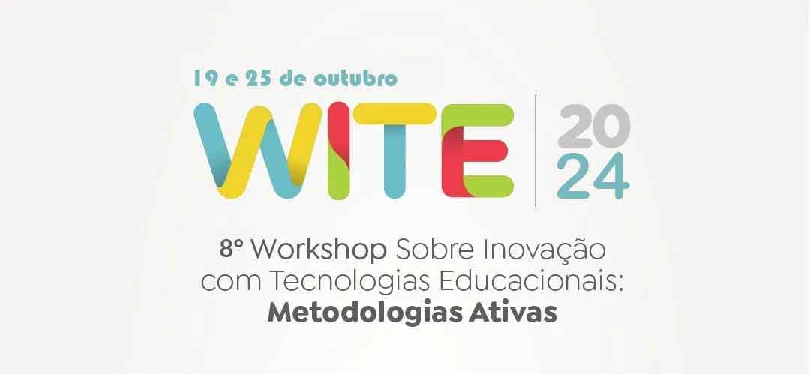
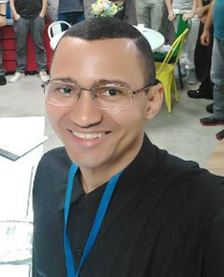

# WITE 2024
8º Workshop sobre Inovação com Tecnologias Educacionais (WITE), promovido pelo Programa de Pós-Graduação em Inovação em Tecnologias Educacionais (PPGiTE) , da Universidade do Rio Grande do Norte (UFRN), no Instituto Metrópole Digital (IMD). O evento tem como objetivo promover o compartilhamento de habilidades multidisciplinares por meio de oficinas ministradas pelos alunos do referido mestrado.

Durante os dois dias de evento, diversas oficinas foram ministradas. Entre as oficinas realizadas, destaca-se a oficina de **robótica educacional**, que é o foco deste documento.

# Robótica Educacional 

Robótica Educacional será um dos temas abordados em uma das oficinas organizadas durante o evento, ela ocorrerá no dia 19 de outubro de 2024, os participantes puderam se inscrever no evento a partir do dia 11/10/2024 até o dia do evento.

A dinâmica da oficina foi baseada em desafios que foram distribuídos a todos os participantes. Eles desenvolveram soluções para cada um dos desafios utilizando dispositivos eletrônicos. Um manual (disponível nesta mesma página) foi fornecido para auxiliar na resolução dos problemas. Os participantes também tiveram acesso a diversos materiais para complementar a estética das soluções.

## Desafios

Cada equipe ficará alocada com um dos desafios que será distribuído individualmente para cada grupo de participantes, cada equipe teve uma média de 7 pessoas por grupo. Abaixo é exposto cada desafio individualmente:

  - [Acessibilidade na Escola](desafio/ACESSIBILIDADE-NA-ESCOLA.md)
  - - Código
  - Instrução
  - [Alguém no Portão](desafio/ALGUEM-NO-PORTAO.md)
    * Código
    * Instrução
  - [Alimentos da Despensa](desafio/ALIMENTOS-DA-DESPENSA.md)
    * Código
    * Instrução
  - Estacionamento Privado
    * Código
    * Instrução
  - [Horta da Escola](desafio/HORTA-DA-ESCOLA.md)
    * Código
    * Instrução
  - [Incêndio na Cozinha](desafio/INCENDIO-NA-COZINHA.md)
     * Código
     * Instrução
  - [Muito quente para jogar](desafio/MUITO-QUENTE-PARA-JOGAR.md)
    * Código
    * Instrução
  - Pega Ladrão
      * Código
      * Instrução
  - [Roedores Ladrões](desafio/ROEDORES-LADROES.md)
      * Código
      * Instrução
  - [Travessia Segura](desafio/TRAVESSIA-SEGURA.md)
      * Código
      * Instrução

## Organizadores

|    Alline Medeiros         |    Jackson Roberio |      Jiulya Kainy       |    Karine Portela       |    Luana Araújo        |    Marialva Silva   |    Raíza       |    Thiago Valneir       |  
| :---: | :---: | :---: | :---: | :---: | :---: | :---: | :---: |

