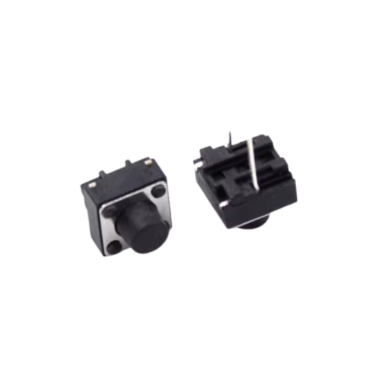
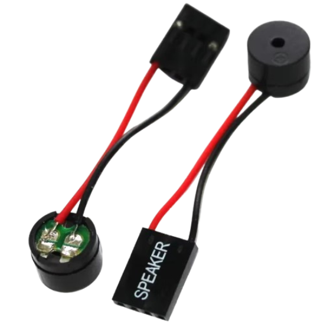
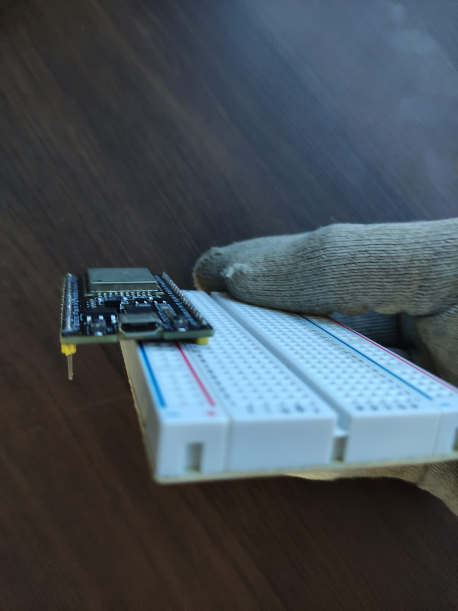
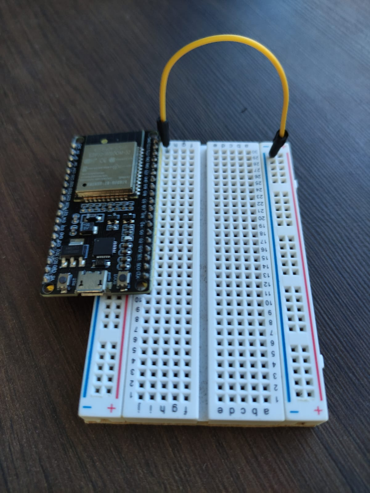
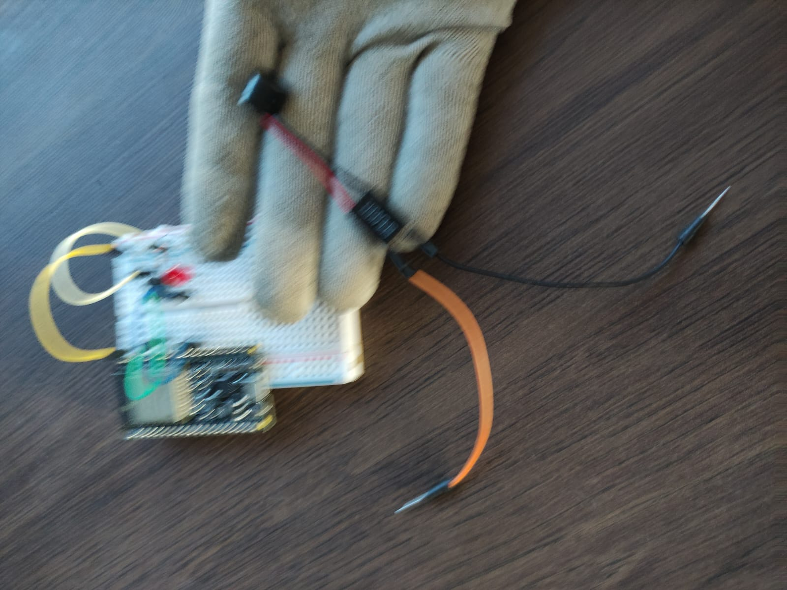

# Desafio 06 - Acessibilidade

## Contexto :thought_balloon:

A nova avenida melhorou o acesso e atraiu novos alunos para a nossa escola. Entre eles, há um aluno com deficiência auditiva que não consegue ouvir a sirene que avisa o início e o término das aulas. Você e seu grupo foram designados para criar um sistema eletrônico que resolva esse problema.

## Solução :heavy_check_mark:

Um novo sistema de sirene, no qual integra a notificação, ao mesmo tempo, por som e por aviso luminoso, acionado por um botão. 

## Instruções para montagem :triangular_flag_on_post:

As instruções informadas aqui são os passos iniciais para resolução do problema, não se limite a realizar apenas as instruções contidas nesse manual, recomenda-se a confecção estética através dos materiais recicláveis ou de apoio.

### Materiais necessários (mínimos) :scroll:

- 1 Protoboard (Conheça mais da protoboard aqui)

  
- 1 Microcontrolador ESP32 (Conheça mais sobre ESP32 aqui)

  
- 1 Botão acionador

- 1 Led

- 1 Resistor

- 1 Speaker (mini alto-falante)

  
- Jumper

### Mãos a massa :hammer:

**Passo 01** : Com a protoboard em mãos, encaixer o ESP32 na terceira fileira de um das extremidades, observe que as duas primeiras fileiras são reservadas para fase (+) e neutro/GND (-), se tiver dúvidas sobre a protoboard veja nosso manual sobre essa placa. Obs. busque o ESP32 que estiver um papel com o número 03 na parte inferior dele, pois esta placa já esta pre-configurada com a programação necessáwria desse desafio.

**Passo 02** : Conecte um cabo da fileira GND (neuto) do ESP32 do protoboard na coluna relativa ao neutro (-) da mesma protoboard.

**Passo 03** : Vamos montar o botão acionado junto a protoboard, para isso será necessário encaixar as duas polaridades (extremidades do botão acionador) em linhas diferentes, encaixe o botão em uma posição que ele fique levemente centralizado, para facilitar os encaixes do fase e do neutro. Em uma das polaridade (são de linhas diferentes) conecte jumpeando junto a coluna de neutro (-) da protoboard, na outra polaridade jampeie junto a linha G21 da protoboard. 

**Passo 04** : O próximo passo pode ser a organização do led, para isso encaixe as duas perninhas do led ao ponto de não ficarem na mesma linha, a linha mais longa do led é responsável pela corrente positiva (+) que será ligada jumpeando junto a entrada G17 da nossa ESP32, a outra perninha do led é o neutro (-), com um resistor de auxílio use-o para fazer a conexão junto a linha neutro (-) do protoboard.

**Passo 05** : Organizaremos o Speaker (mini alto-falante) para facilitar a conexão na protoboard, para isso com o uso de dois jumpers diferentes conecter em cada uma de suas extermidades, leve em consideração que o fio vermelho do Speaker é relativo a fase (+) e o outro fio ao neutro (-). 

**Passo 06** : Com as extensões do Speaker pronta para encaixar na protoboard, coloque-as na linha do protoboard referente a entrada G15 da nossa placa ESP32 o cabo de polaridade fase (+) e o cabo de polaridade neutro encaixe na coluna de neutro (-) da nossa protoboard.

**Passo 07** : Pronto, o dispositivo foi montado, após realizar todos os passos corretamente solicite a avaliação de um dos monitores da oficina para rever se a solução foi aplicada corretamente e testar em uma fonte de energia.

**Passo 08** : Confirmado que a solução esta funcionando, agora realize, com o material de apoio e descartáveis, uma solução estética mais agradável para o seu desafio. O grupo que entreguar o melhor projeto ganhará um brinde :gift:.

[Clique aqui caso deseje conferir o código fonte pré-programado dessa solução.](../midia/desafio/acessibilidade-na-escola/codigo_fonte.ino)
