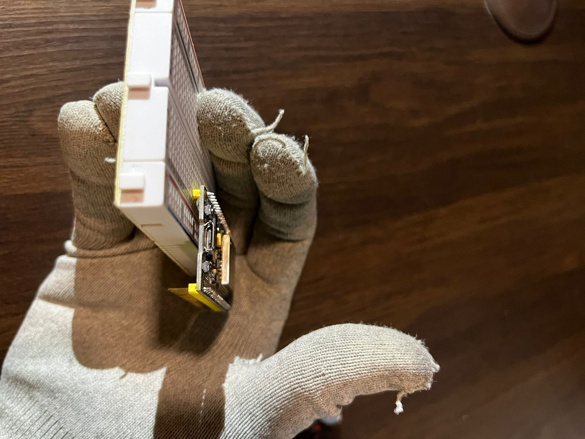
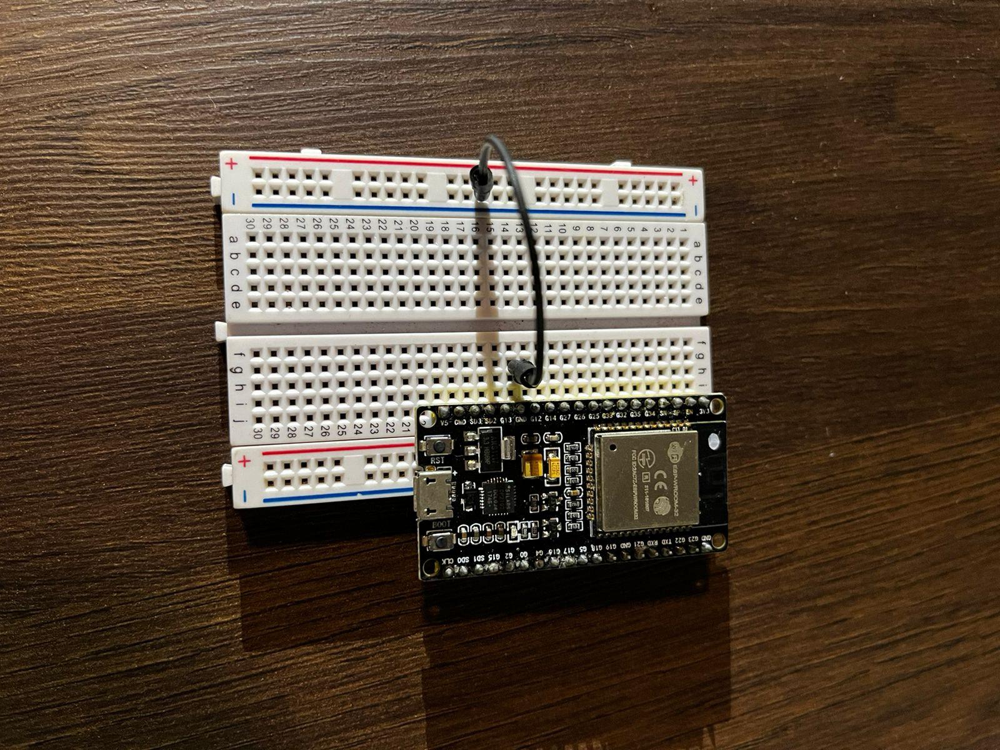
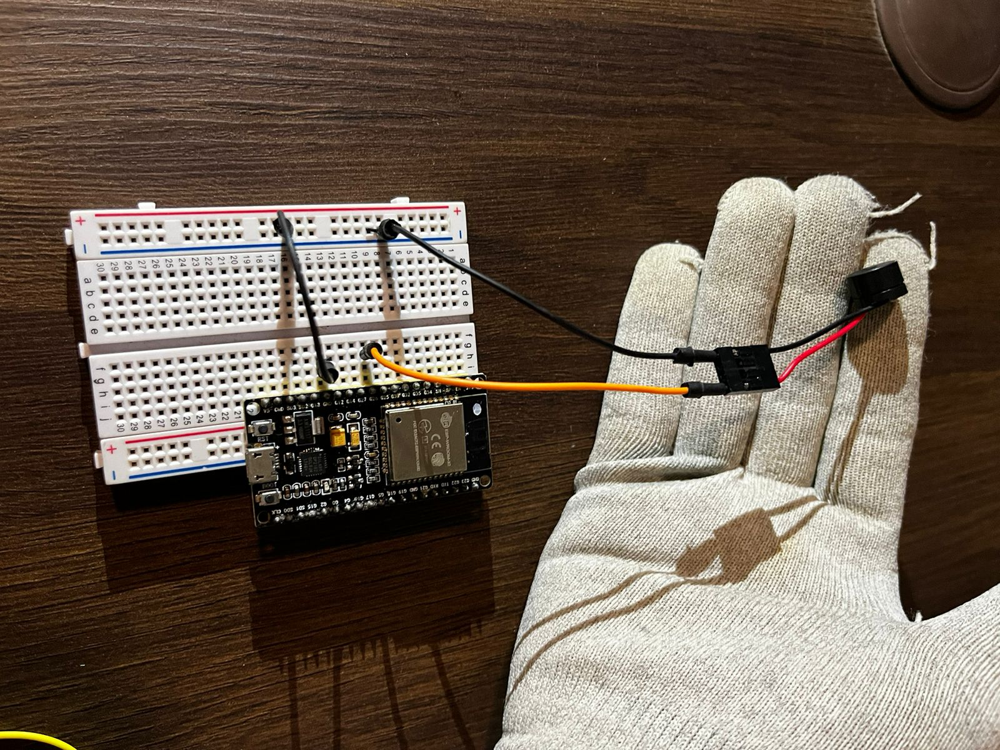
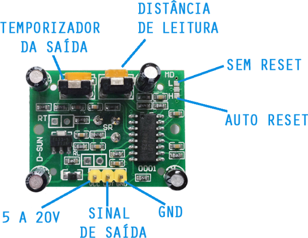
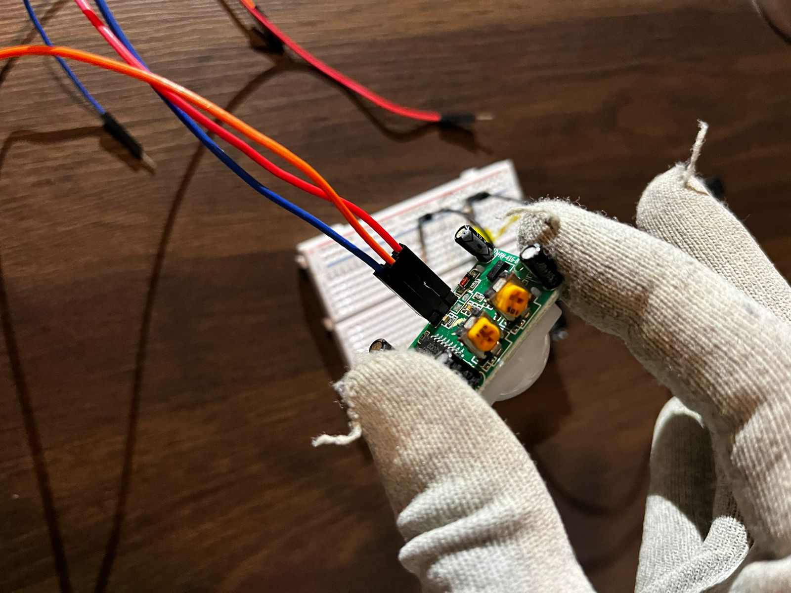

# Desafio 04 - Alguém no Portão

## Contexto :thought_balloon:

A nova avenida facilitou o acesso à escola, atraindo muitos visitantes, o que aumentou o fluxo de pessoas na recepção. A secretária, que às vezes fica sozinha, não consegue fazer seu trabalho na secretaria, pois está sempre preocupada com um possível visitante que pode estar no portão. Você e seu grupo receberam a tarefa de projetar um sistema para solucionar esse problema, garantindo que a secretária fique tranquila, sabendo que será avisada cada vez que uma pessoa entrar pelo portão.

## Solução :heavy_check_mark:

Sistema de notificação por luz ou por som ativado por sensor de presença (acionado automaticamente quando alguém entra pelo portão da escola). O sistema deve ser sensível ao movimento.

## Instruções para montagem :triangular_flag_on_post:

As instruções informadas aqui são os passos iniciais para resolução do problema, não se limite a realizar apenas as instruções contidas nesse manual, recomenda-se a confecção estética através dos materiais recicláveis ou de apoio.

### Materiais necessários (mínimos) :scroll:

- 1 Protoboard (Conheça mais da protoboard aqui)

  
- 1 Microcontrolador ESP32 (Conheça mais sobre ESP32 aqui)

  
- 1 Sensor de presença

- 1 Speaker (mini alto-falante)

- 1 Led

  
- Jumper (macho x macho / macho x fêmea)

_macho x macho_

_macho x fêmea_

### Mãos na placa :hammer:

**Passo 01** : Pegue uma protoboard e um microcontrolador ESP32 que estiver com a númercação 08 escrita na parte inferior dele, é necessário escolher esse microcontrolador específico devido ao código fonte já esta pré-programada nele.
Com a protoboard e o ESP32 em mãos, encaixer o ESP32 na terceira fileira de um das extremidades, observe que as duas primeiras fileiras são reservadas para fase (+) e neutro/GND (-), se tiver dúvidas sobre a protoboard veja nosso manual sobre essa placa.

**Passo 02** : Vamos agora fazer uma conexão da linha que conecta o GND (neutro) da nossa placa para a coluna neutro (-) da protoboard, para identificar a coluna neutro na protoboard basta observar no canto superior, ela tem os polos fase (+) e neutro (-), eles geralmente estão nas laterais dos protoboards.

**Passo 03** : Agora vamos conectar o Speaker (mini auto-falante), para isso precisamos separar dois Jumper's _macho x macho_ para fazer a conexão com o componente, 
repare que no Speaker há quatro encaixes, porém só existe poaridade em dois que são um em cada ponta do Spekar, o fio preto do Speaker é referente a polaridade neutro (-) e o fio vermelho a polaridade fase (+),
escolha as cores do jumper a seu desejo, porém tenha a noção para cada cor irá representar, pois através delas nos encaixaremos as polaridades na nossa placa. 
Encaixado os jumper's no Speaker, encaixe a perna da extremidade neutro (-) na coluna neutro (-) do nosso protoboard, pois a nosso microcontrolador ESP32 já esta jampeando o GND/Neutro nela. 
A outro cabo do Speaker deve ser conectado na linha da protoboard que faz conexão com a porta G14 do nosso microcontrolador.

**Passo 04** : Agora conectaremos o Led, escolha a cor do Led que mais lhe agrade, perceba que o led terá uma perna maior que a outra, esta identifica a polaridade fase (+) dele, para o led que tiver a polaridade fase (aquele que tem a perna maior) faça um jumper com a linha da protoboard que liga o G14 do nosso microcontrolador.
A outra perna você irá conectar um resistor que fará ligação com a coluna neutra (-).

**Passo 05** : Para prosseguirmos eu irei falar brevemente sobre o sensor de presença, este sensor pode ser configurado manualmente para a distância de captação do movimento e o tempo que ele identificará a presença, com o sensor virado para parte inferior e com os conectores de cabo virado para você, iremos configurar a sensibilidade de duração de captação, para isso solicito que vire com uma chave de fenda o botão amarelo do lado esquerdo, vire ela para o lado esquerdo.
Agora preste atenção nos três cabos de conexão, é importante conectar eles de uma forma correta para seu pleno funcionamento, na mesma posição você terá o conector do lado esquerdo sendo uma entrada de energi de 5 a 20V; o conector do meio é relativo ao cabo de dados, ele informa a placa quando há presença; o conector do lado direito é o polo neutro (-).

**Passo 06** : Ciente das conexões do sensor de presença, separe três jumper's _macho x fêmea_ de cores diferentes para identificação na hora de conexão na protoboad e no microcontrolador. 
O nosso ESP32 tem uma porta 5V, ela é a primeira de cima para baixo do lado esquerdo, faça a conexão da primeira entrada do sensor de presença nela, use a linha do protoboard relativa para essa conexão.
Na programação de nossa placa a conexão de dados (entrada do meio do sensor de presença) deve ser encaixada na linha da nossa protoboard que faz conexão com a porta G13 do nosso microcontrolador.
Por último conecte o cabo neutro/GND na coluna neutro (-) de nossa protoboard.

**Passo 06** : Pronto, se seguiu os passos corretamente o seu ambiente de trabalho deve ter ficado semelhante a imagem abaixo:

**Passo 07** : Realizado todos os passos corretamente, solicite a avaliação de um dos monitores da oficina para rever se a solução foi aplicada corretamente e testar em uma fonte de energia.

[Clique aqui caso deseje conferir o código fonte pré-programado dessa solução.](../midia/desafio/08/codigo_fonte.ino)
