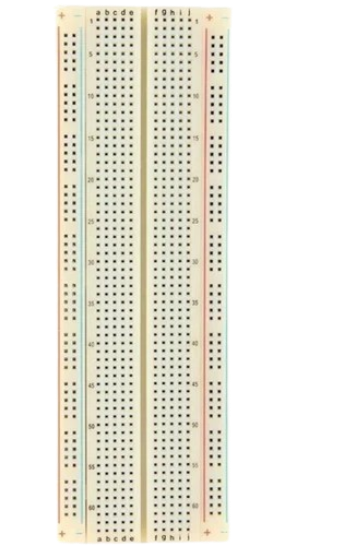
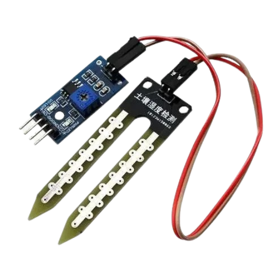
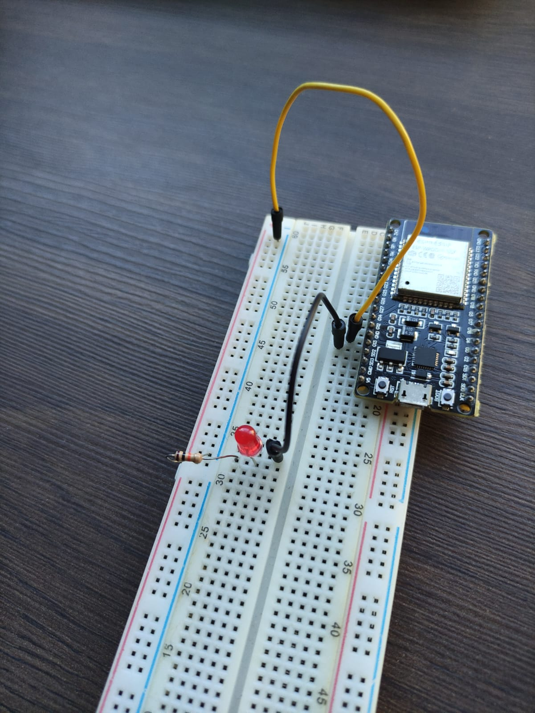
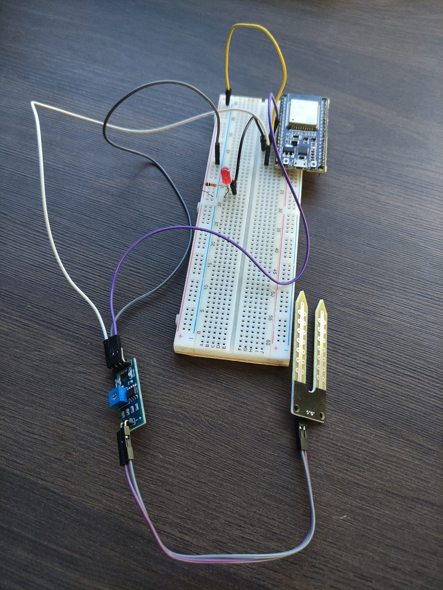

# Desafio 03 - Horta da Escola :sunflower:

## Contexto :thought_balloon:

Com a derrubada das árvores para a construção da nova avenida em frente à nossa escola, a horta dos alunos do 5º ano passou a receber maior incidência de sol, o que aumentou o calor e fez com que algumas plantas morressem por falta de água. Você e seu grupo foram encarregados de projetar um sistema automático para solucionar o problema.

## Solução :heavy_check_mark:

Sistema de detecção de umidade do solo, capaz de identificar quando as plantas precisam de água. O sistema deve ser ajustável às necessidades específicas de diferentes tipos de plantas, garantindo uma irrigação eficiente.

## Instruções para montagem :triangular_flag_on_post:

As instruções informadas aqui são os passos iniciais para resolução do problema, não se limite a realizar apenas as instruções contidas nesse manual, recomenda-se a confecção estética através dos materiais recicláveis ou de apoio.

### Materiais necessários (mínimos) :scroll:

- 1 Protoboard (Conheça mais da protoboard aqui) 

- 1 Led

- 1 Resistor

  

- 1 Sensor de umidade do solo

  

- 1 Microcontrolador ESP32 (Conheça mais sobre ESP32 aqui)

- Jumper's 

 

_macho x macho_

 

_macho x fêmea_

### Mãos a obra :hammer:

As instruções repassadas nesse manual terão uma pespectiva final semelhante a animação abaixo:

Para isso vamos montar peça por peça.

**Passo 01** : Conecte o Microcontrolador ESP32 na protoboard de forma a encaixa livrando as colunas de polaridade fase (+) e neutro (-). Obs. busque o microcontrolador que estiver um papel com a número 03 na parte inferior dele, pois este microcontrolador estará configurado com a programação da solução deste desafio.

 

**Passo 02** : Faça a ligação da linha que conecta o GND (neutro) do ESP32 conectado na protoboard com a coluna da protoboard reservada para trilha neutro (-), o protoboard geralmente identifica com o sinal de menos (-).

 

**Passo 03** : Vamos montar o led que será responsável por enviar informações visuais caso nossa horta esteja seca, para isso encaixe o led de modo que não esteja conectado na mesma linha (na protoboard as linhas são numeradas e as colunas são letras do alfabeto), a perninha maior do led é relativa a polaridade positiva (+), para esta polaridade conecte um jumper que der acesso a entrada G13. Insira um resistor na polaridade oposta do led, a polaridade neutro (-), este resistor tem que esta conectado com a coluna neutro (-) da protoboard, esta coluna é identificada com o sinal menos (-).

 

**Passo 04** : Agora vamos encaixar os fios no sensor de presença, o sensor de presença é dividido em duas partes, a placa lógica e a placa terra (que fica aterrada). É preciso realizar a conexão da placa lógica com a placa terra, para isso use um fio jumper _fêmea x fêmea_, aqui não precisa se preocupar com a polaridade, as duas posições com duas únicas entradas é o lugar correto de se conectar a cada lado. 
Na placa lógia, e em posição oposta, há quatro pinos que três deles devem ser conectados com jumpers _macho x fêmea_, classificados assim da direita para esquerda: 
 - VCC : porta responsável que conectar a energia, para esta porta é preciso usar rede eletrica de 5V, encaixe esse cabo na porta 5V do ESP32 através da protoboard;
 - GND é a polaridade neutro (-) da placa lógica, conecte-o na coluna de polaridade neutro (-) da protoboard;
 - D0 : é a entrada digital, a placa há entrada digital e analógica, para nosso código usaremos ela, conecte esta porta junto a trilha G27 do nosso microcontrolador (ESP32);
 - A0 : é a entrada analógica, não trabalharemos com ela, então você pode ignorar essa conexão.

 

**Passo 05** : Realizado a conecxão corretamente você terá algo semelhante a imagem abaixo.

 

**Passo 06** : Realizado todos os passos corretamente, solicite a avaliação de um dos monitores da oficina para rever se a solução foi aplicada corretamente e testar em uma fonte de energia.

**Passo 07** : Confirmado que a solução esta funcionando, agora realize, com o material de apoio e descartáveis, uma solução estética mais agradável para o seu desafio. O grupo que entreguar o melhor projeto ganhará um brinde :gift:.

[Clique aqui caso deseje conferir o código fonte pré-programado dessa solução.](../midia/desafio/03/codigo_fonte.ino)

  
