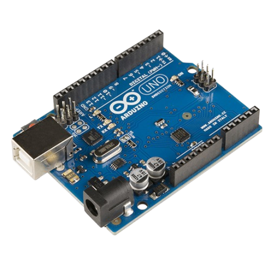
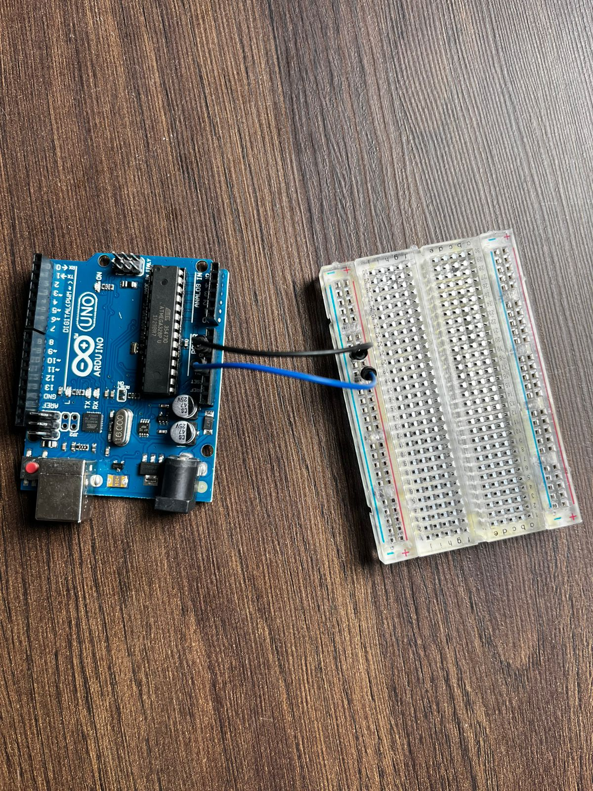
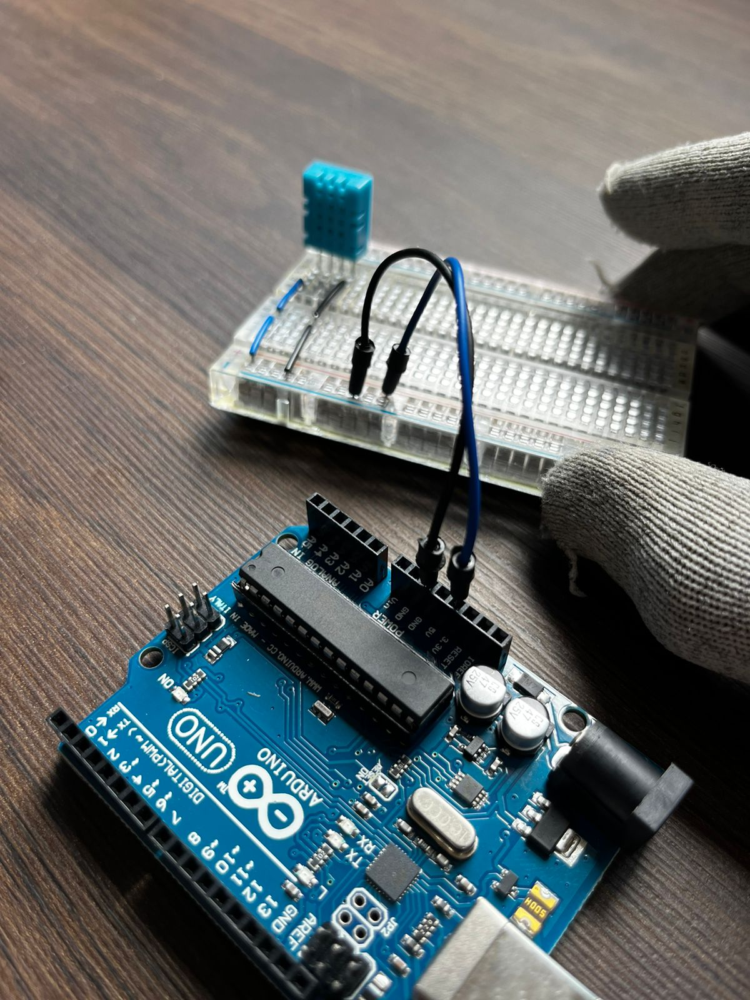
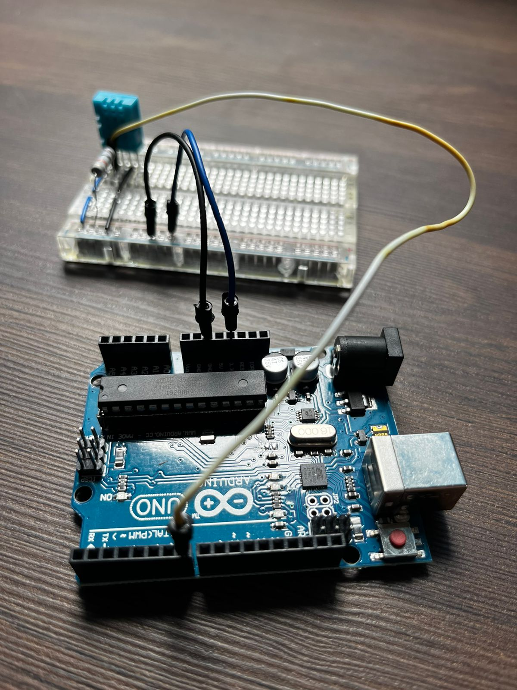

# Desafio : Incêndio na cozinha

## Contexto :thought_balloon:

Com o aumento do número de alunos na escola, a quantidade de comida a ser preparada na cozinha também aumentou, o que deixou o trabalho da cozinheira bastante sobrecarregado. Em uma manhã, quase houve um incêndio na escola. Para prevenir ou minimizar possíveis acidentes, você e seu grupo receberam a tarefa de projetar um sistema automatizado de detecção de incêndio que notifique em caso de uma panela pegar fogo.

## Solução :heavy_check_mark:

Sistema de alarme por som, informando, após leitura de temperatura através de sensores, condições de possível incêndio.  

## Instruções para montagem :triangular_flag_on_post:

As instruções informadas aqui são os passos iniciais para resolução do problema, não se limite a realizar apenas as instruções contidas nesse manual, recomenda-se a confecção estética através dos materiais recicláveis ou de apoio.

### Materiais necessários (mínimos) :scroll:

- 1 Protoboard (Conheça mais da protoboard aqui) 

- 1 Microcontrolador Arduino

- 1 Resistores
  
  

- 1 Sensor de temperatura e umidade

  

- 1 Speaker
  
  

- Jumper

 

### Mãos a obra :hammer:

**Passo 01** : Dentro os materiais disponíveis, busque o microcontrolador Arduino com o o número deste desafio na sua parte inferior, este número estará escrito em papel e pregado no dispositivo. 
Pegue qualquer protoboard para fazer este desafio. Faça a conexão da porta GND do Arduino na coluna neutro (-) da nossa protoboard, a protoboard identifica a coluna neutro com a cor azul e na parte superior tem o símbolo de menos (-).
De modo semelhante, faça a conexão da porta 3.3V da porta do Arduino na coluna fase (+) da nossa protoboard, a coluna fase é identificável pela cor vermelha na protoboard e tem o símbolo de mais (+) na parte superior.

 

**Passo 02** : Agora vamos trabalhar com o sensor de temperatura e umidade, para isso vou dar uma breve explicação sobre o sensor, para saber o sensor tem 4 pernas, porém apenas três são utilizadas, sendo elas da esquerda pra direita: 
- 1ª perna: responsável pela carga energetica, é necessário passsa entre 3 a 5V para seu funcionamento, trabalharemos com a porta de 3V3 do Arduino;
- 2ª perna: responsável pela informação dos dados captados, ele envia os dados para a placa de acordo com a captura do ambiente, nele é possível intepretar a undiade do ar ou a temperatura;
- 3ª perna: inutilizável, ignore-a;
- 4ª perna: responsável pela carga neutro (-), conecte esta extremidade na coluna neutro (-) do protoboard ou em nossa placa Arduino. 

 

**Passo 03** : Vamos montar pausadamente as conexões para funcionamento do nosso sensor de temperatura, primeiramente encaixe-o de forma que ele fique organizado em uma mesma coluna, esta coluna não pode ser a coluna fase (+) ou neutra (-) da protoboard, escolha uma das colunas do alfabeto.
Encaixado o sensor de temperatura, agora jampeie a conexão do seu pino do lado esquerdo na coluna fase (+) de nossa protoboard (em nosso exemplo usado o cabo azul),
em seguida jumpeie a extremidade direita do nosso sensor na coluna neutro (-) de nossa protoboard (em nosso exemplo o cabo de cor preta).

 

**Passo 04** : Seguirmos com a montarem da pinagem do sensor de tempeartura, agora conectaremos o jumper de dados, ele encontra-se ao lado da entrada de energia, é o segundo da esquerda para direita. 
Para este cabo vamos fazer duas conexões, um jumper para a nossa porta 7 (digital) do nosso microcontrolador, e outra para a coluna fase (+) de nossa protoboard, mas para isso precisaremos colocar um resistor antes
de realizar o jumper para a coluna fase (+) de nossa protoboard. Então, para que você não ficar perdido, o nosso sensor leva duas conexões para a corrente 3.3V que é identificada pela coluna fase (+) em nossa protoboard,
e a linha de dados do nosso sensor de presença (em nosso exemplo também conectado na porta 7 digital do Arduino). 
Obs. como os resistores tem potências distinstas, achamos por bem deixar os resistores do Led livres e o resistor do sensor de temperatura estará colado com um adesivo no próprio sensor, pode desconectar o adesivo e usa-lo normalmente.

 

**Passo 05** : Agora vamos conectar os cabos em nossa Speaker (mini alto-falante), para isso é importante frisar que na Speaker há 4 entrada, porém só apenas duas funcionam, dar pra identificar as entradas pelas cores dos cabos da própria Speaker,
a cor preta é relativa a polaridade neutro (-) da Speaker e a cor vermelha é a polaridade fase (+). Busque dois jumpers de cores diferentes e conecter em cada uma das extremidades da Speaker.

 

**Passo 06** : Por último vamos conectar a nossa Speaker na protoboard e no Arduino, para isso conecte o cabo referente ao fase (+) do Speaker na porta 4 (digital) do nosso Arduino, o outro cabo deve ser conectado na coluna neutro (-) de nossa protoboard.

 

**Passo 07**: Pronto, trabalho concluído, se realizado todos os passos corretamente, solicite a avaliação de um dos monitores da oficina para rever se a solução foi aplicada corretamente e testar em uma fonte de energia.

**Passo 08** : Confirmado que a solução esta funcionando, agora realize, com o material de apoio e descartáveis, uma solução estética mais agradável para o seu desafio. O grupo que entreguar o melhor projeto ganhará um brinde :gift:.

[Clique aqui caso deseje conferir o código fonte pré-programado dessa solução.](../midia/desafio/incendio-na-cozinha/codigo_fonte.ino)

  
