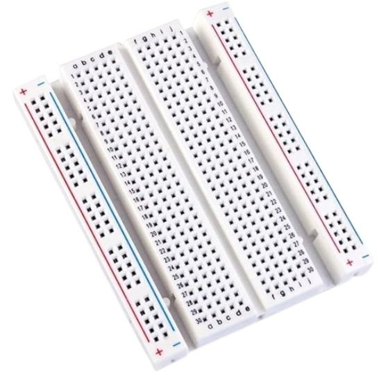
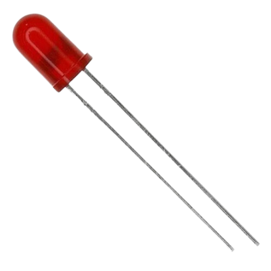
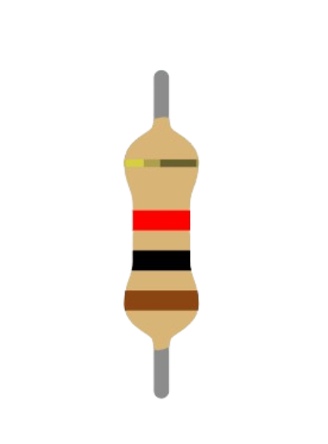
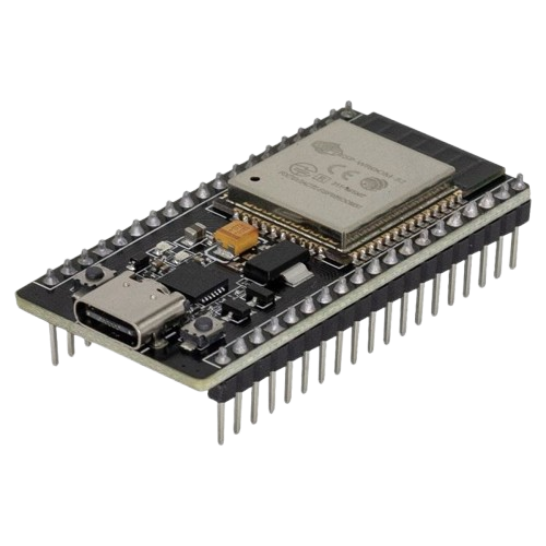
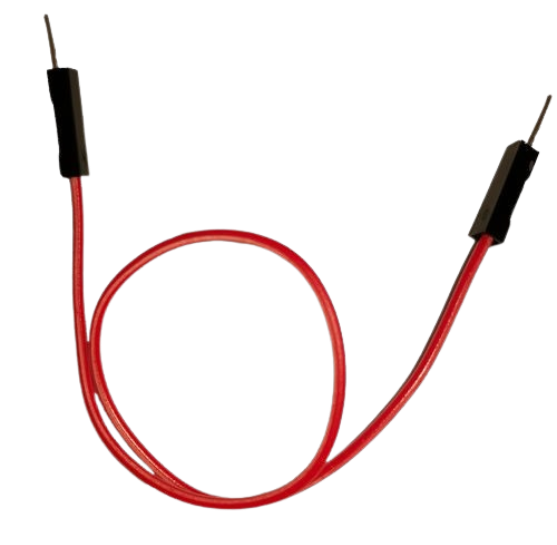
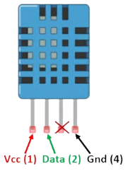
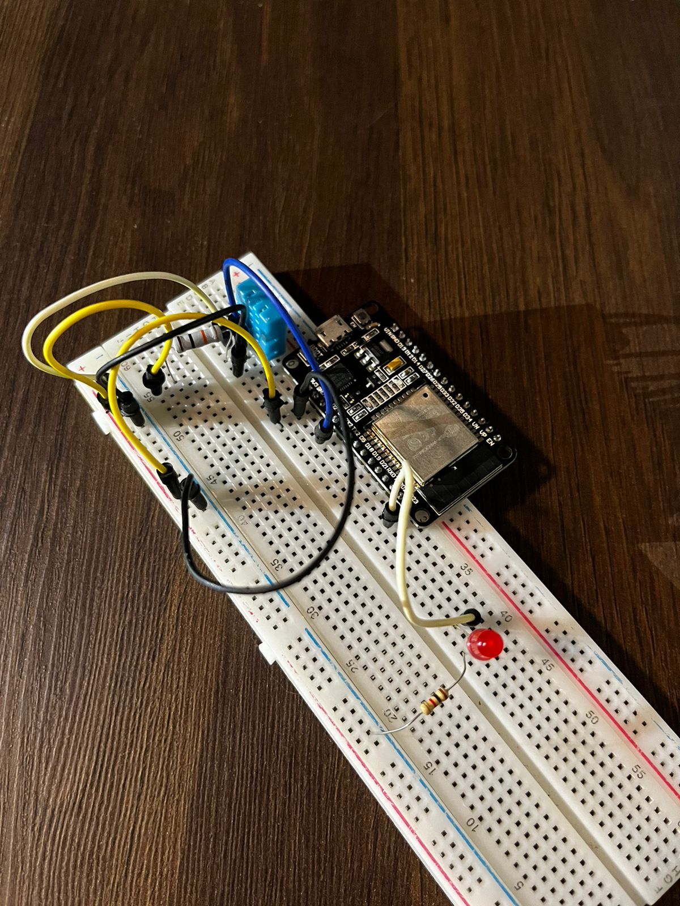

# Desafio : Muito Quente para Jogar

## Contexto :thought_balloon:

Após a remoção das árvores para a construção da avenida, o campo de futebol da escola perdeu a proteção contra o sol, resultando em um aumento da temperatura, mesmo pela manhã. Isso levou alguns alunos a se sentirem mal durante os jogos. Você e seu grupo receberam a tarefa de projetar um sistema automatizado que avise os alunos quando a temperatura estiver muito elevada, indicando o momento de entrar.

## Solução :heavy_check_mark:

Sistema de notificação por som e/ou visual (com LED) informando, após leitura de temperatura e umidade, através de sensores, a temperatura aceitável para jogar ao ar livre. 

## Instruções para montagem :triangular_flag_on_post:

As instruções informadas aqui são os passos iniciais para resolução do problema, não se limite a realizar apenas as instruções contidas nesse manual, recomenda-se a confecção estética através dos materiais recicláveis ou de apoio.

### Materiais necessários (mínimos) :scroll:

- 1 Protoboard (Conheça mais da protoboard aqui) 

- 1 Led

- 2 Resistores (um para o Led e outro para o Sensor de temperatura)

  

- 1 Microcontrolador ESP32 (Conheça mais sobre ESP32 aqui)

- 1 Sensor de temperatura e umidade

  

- Jumper

 

### Mãos a obra :hammer:

**Passo 01** : Dentro os materiais disponíveis, busque o microcontrolador ESP32 com o o número 10 na sua parte inferior, este número estará escrito de papel e pregado no dispositivo. 
Pegue qualquer protoboard para fazer este desafio. 
Encaixe o ESP32 ao ponto de livrar as colunas fase (+) e neutro (-) da protoboard, essas colunas são identificadas por uma lista de cor azul que simboliza o neutro e tem o desenho de menos (-) na parte superior, e o de cor vermelho que é a coluna reservada para fase (+) e tem o simbolo de soma (+) na parte superior.

 

**Passo 02** : agora vamos energizar os polos fase (+) e neutro (-) da protoboard, para isso procure pela entrada GND do ESP32 e realize o jumnper para a coluna neutro (-) da protoboard.
Aproveite e também faça um jumper conectando a porta 3V3 de nosso microcontrolador (ESP32) para a coluna fase (+) de nossa protoboard.

 

**Passo 03** : Agora vamos trabalhar com o sensor de temperatura e umidade, para isso vou dar uma breve explicação sobre o sensor, para saber o sensor tem 4 pernas, porém apenas três são utilizadas, sendo elas da esquerda pra direita: 
- 1ª perna: responsável pela carga energetica, é necessário passsa entre 3 a 5V para seu funcionamento, trabalhatemos com a porta de 3V3 do ESP32;
- 2ª perna: responsável pela informação dos dados captados, ele envia os dados para a placa de acordo com a captura do ambiente, nele é possível intepretar a undiade do ar ou a temperatura;
- 3ª perna: inutilizável, ignore-a;
- 4ª perna: responsável pela carga neutro (-), conecte esta extremidade na coluna neutro (-) do protoboard ou em nossa placa ESP32. 

 

**Passo 04** : Vamos montar pausadamente as conexões para funcionamento do nosso sensor de temperatura, primeiramente encaixe-o de forma que ele fique organizado em uma mesma coluna, esta coluna não pode ser a fase (+) ou neutra (-) da protoboard, escolha uma das colunas do alfabeto.
encaixado o sensor de temperatura, agora jampeie a conexão do seu pino do lado esquerdo na coluna fase (+) de nossa protoboard,
em seguida jumpeie a ponta direita do nosso sensor na coluna neutro (-) de nossa protoboard.

 

**Passo 05** : Seguirmos com a montarem da pinagem do sensor de tempeartura, agora conectaremos o jumper de dados, ele encontra-se ao lado da entrada de energia, é o segundo da esquerda para direita. 
Para este cabo vamos fazer duas conexões, um jumper para a nossa porta D4 do nosso microcontrolador, e outra para a coluna fase (+) de nossa protoboard, mas para isso precisaremos colocar um resistor antes
de realizar o jumper para a coluna fase (+) de nossa protoboard. Então, para você não ficar perdido, o nosso sensor leva duas conexões para a corrente 3V3 que é identificada pela coluna fase (+) em nossa protoboard,
não se preocupe, é assim mesmo, e a linha de dados além de jumpear para a coluna de fase (+) da protoboard, também leva para a nossa porta lógica D4 do nosso ESP32. 
Obs. como os resistores tem potências distinstas, achamos por bem deixar os resistores do Led livres e o resistor do sensor de temperatura estará colado com um adesivo no próprio sensor, pode desconectar o adesivo e usa-lo normalmente.

 

**Passo 06** : Por último vamos conectar o nosso Led, escolha o led do seu gosto nos kits disponíveis, perceba que todos os leds tem uma perna maior que a outra, esta perna maior é relativa a polaridade positiva/fase, 
ele deverá esta conectado na nossa porta lógica D23 do nosso ESP32, a outra perna é a neutro (-), esta perna deve esta conectada na coluna neutro(-) de nossa protoboard, mas lea não pode ser conectada diretamente 
nesta coluna, é preciso colocar um resistor intermediando, caso contrário o led poderá ser queimado.

 

**Passo 07**: Pronto, trabalho concluído, se realizado todos os passos corretamente, solicite a avaliação de um dos monitores da oficina para rever se a solução foi aplicada corretamente e testar em uma fonte de energia.

**Passo 08** : Confirmado que a solução esta funcionando, agora realize, com o material de apoio e descartáveis, uma solução estética mais agradável para o seu desafio. O grupo que entreguar o melhor projeto ganhará um brinde :gift:.

[Clique aqui caso deseje conferir o código fonte pré-programado dessa solução.](../midia/desafio/muito-quente-para-jogar/codigo_fonte.ino)

  
