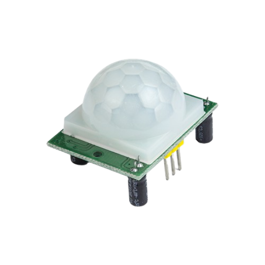
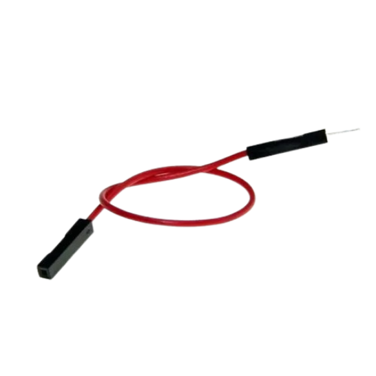
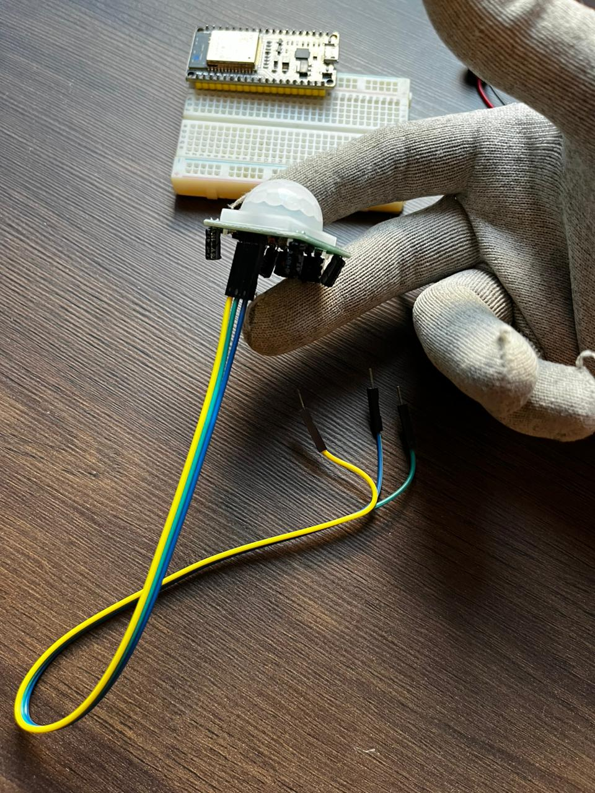
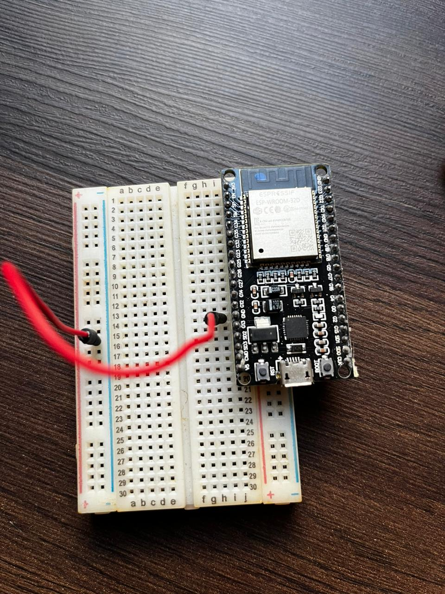
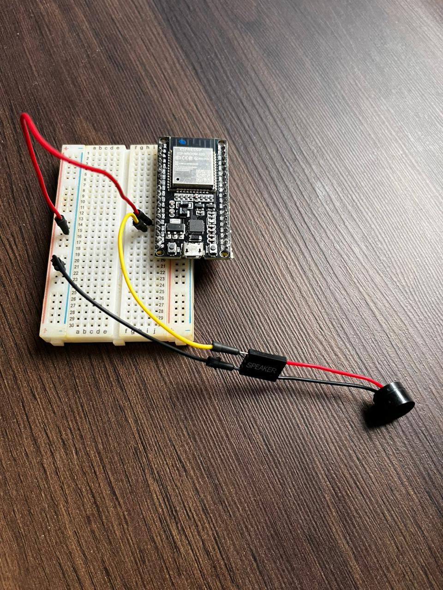
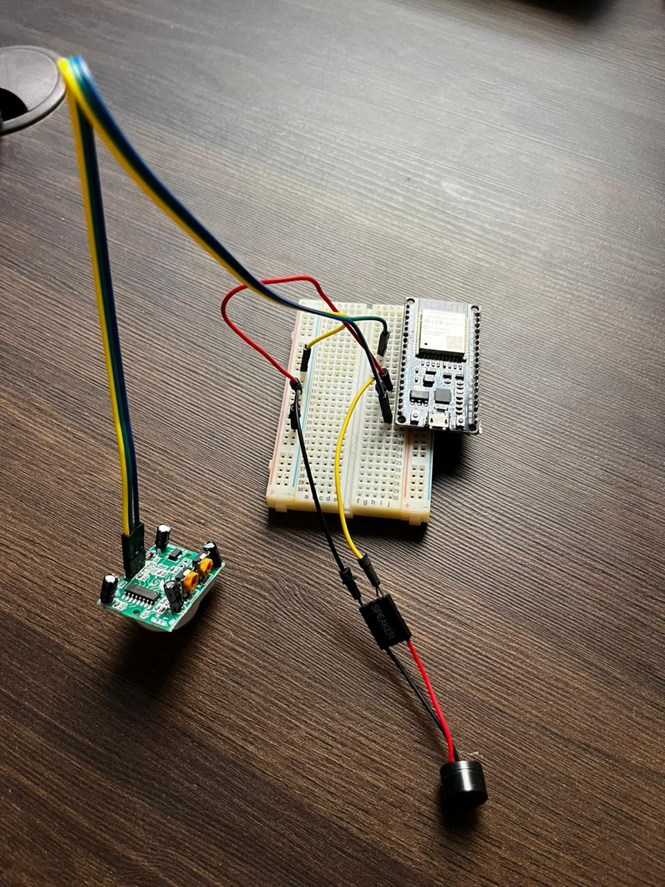
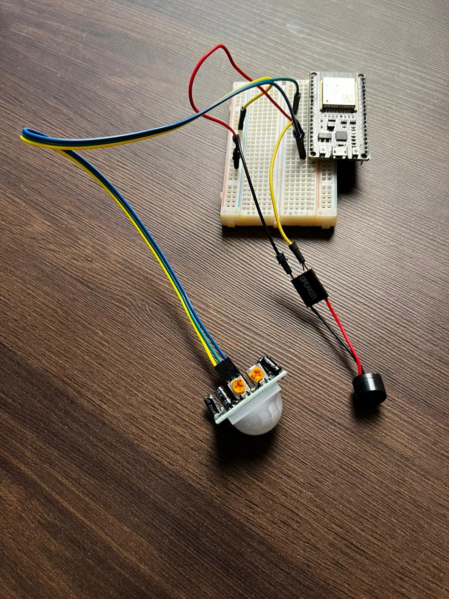

# Desafio 04 - Roedores Ladrões

## Contexto :thought_balloon:

Além da falta de água, a horta dos alunos do 5º ano enfrenta outro desafio: a invasão de roedores, que estão devorando os legumes e verduras. Para resolver esse problema, você e seu grupo foram encarregados de projetar um sistema automático para afugentar os roedores.

## Solução :heavy_check_mark:

Alarme capaz de detectar a aproximação dos roedores. O sistema deve identificar a presença deles e emitir um alerta para afastá-los, garantindo a proteção das plantas.

## Instruções para montagem :triangular_flag_on_post:

As instruções informadas aqui são os passos iniciais para resolução do problema, não se limite a realizar apenas as instruções contidas nesse manual, recomenda-se a confecção estética através dos materiais recicláveis ou de apoio.

### Materiais necessários (mínimos) :scroll:

- 1 Protoboard (Conheça mais da protoboard aqui)

  
- 1 Microcontrolador ESP32 (Conheça mais sobre ESP32 aqui)

  
- 1 Sensor de presença

- 1 Speaker (mini alto-falante)

  
- Jumper (macho x macho / macho x fêmea)

_macho x macho_

_macho x fêmea_

### Mãos na placa :hammer:

As instruções repassadas nesse manual terão uma pespectiva final semelhante a imagem abaixo:

Para chegar nesse estado, vamos montar peça por peça através dos passos abaixo.

**Passo 01** : Com a protoboard em mãos, encaixer o ESP32 na terceira fileira de um das extremidades, observe que as duas primeiras fileiras são reservadas para fase (+) e neutro/GND (-), se tiver dúvidas sobre a protoboard veja nosso manual sobre essa placa.

**Passo 02** : Pegue a Speaker (mini alto-falante) e conecter em suas extremidades os polos negativos/GND (-) e positivo (+), vale salientar que o polo negativo/GND é o de fio escuro e o de cor vermelha é o de polo positivo (+), neste momento não encaixaremos o Speaker na protoboard, somente encaixaremos os jumper's _macho x macho_ nas extremidades do Speaker. 

**Passo 03** : Em um processo semelhante ao do passo 02, agora faremos no sensor de presença, separe três jumper's _macho x fêmea_ e encaixe nas posições relativas a polaridade, recomenda-se usar jumper's de cores diferentes para facilitar a identificação. Caso não saiba onde encaixar os cabos, recomendamos a leitura das instruções do Sensor de presença.  

**Passo 04** : Agora famos encaixar os jumper's na protoboard, vamos começar pelo trilhar negativa/GND (-) da protoboard, separe um jumper _macho x macho_, para isso conecte em qualquer posição do negativo (-) da proboard e na outra extremidade do cabo na trilha que estiver encaixado o GND do ESP32.

**Passo 05** : Com o Speaker em mão, conecte o cabo negativo do spekear na trilha neutro (-) da protoboard, vale salientar que a perta de cor preta do speaker é a perna onde a polaridade deve esta conectado na negativa. O outro cabo da Speaker encaixe na trilha do protoboard que estiver conectado a porta G13 do ESP32. 

**Passo 06** : Agora vamos conectar os cabos do sensor de presença, o cabo do meio é relativo ao cabo de dados, onde transmitirá o valor se há presença ou não para o nosso microcontrolador (no nosso caso o ESP32), coloque o cabo do meio na trilhar da protoboard conectada na porta G27 do ESP32. Os outros dois cabos coloque na porta 5V e na trilha neutro (-) da protoboard, observe que há uma polarização exata de conexão e é recomendado verificar a página de instrução do sensor de presença para realizar a conexão correta.

**Passo 07** : Com todos sensores conectados podemos realizar a configuração de aproximação e tempo de captação de permanência de presença, para isso, e se necessário, com uma chave de fenda posicione um dos encaixes amarelos do sensor de presença (há dois), eles realizarão essa configuração, vale salientar que ao ligar o sensor em uma fonte de energia não será possível alterar essas sensibilidades, então caso não esteja do seu interesse, desconecte da energia e reconfigure a sensibilidade do sensor de presença e reconecte na energia para avaliação.  

**Passo 08** : Realizado todos os passos corretamente, solicite a avaliação de um dos monitores da oficina para rever se a solução foi aplicada corretamente e testar em uma fonte de energia.

**Passo 09** : Confirmado que a solução esta funcionando, agora realize, com o material de apoio e descartáveis, uma solução estética mais agradável para o seu desafio. O grupo que entreguar o melhor projeto ganhará um brinde :gift:.

_Imagens ilustrativa par aguçar sua criatividade_

[Clique aqui caso deseje conferir o código fonte pré-programado dessa solução.](../midia/desafio/01/codigo_fonte.ino)
